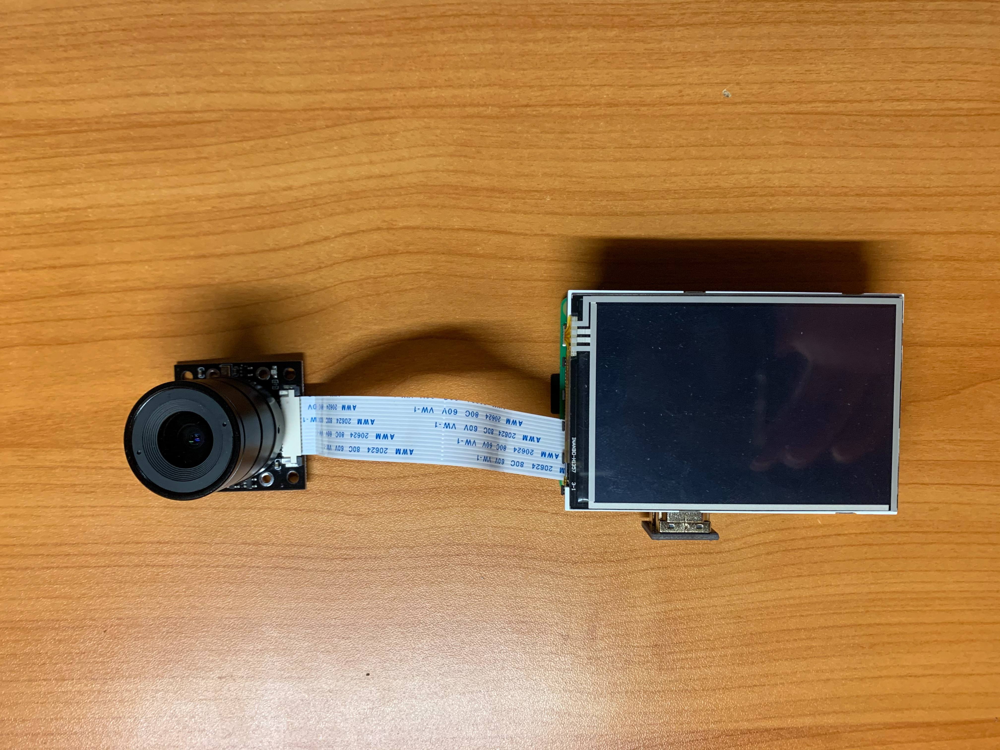
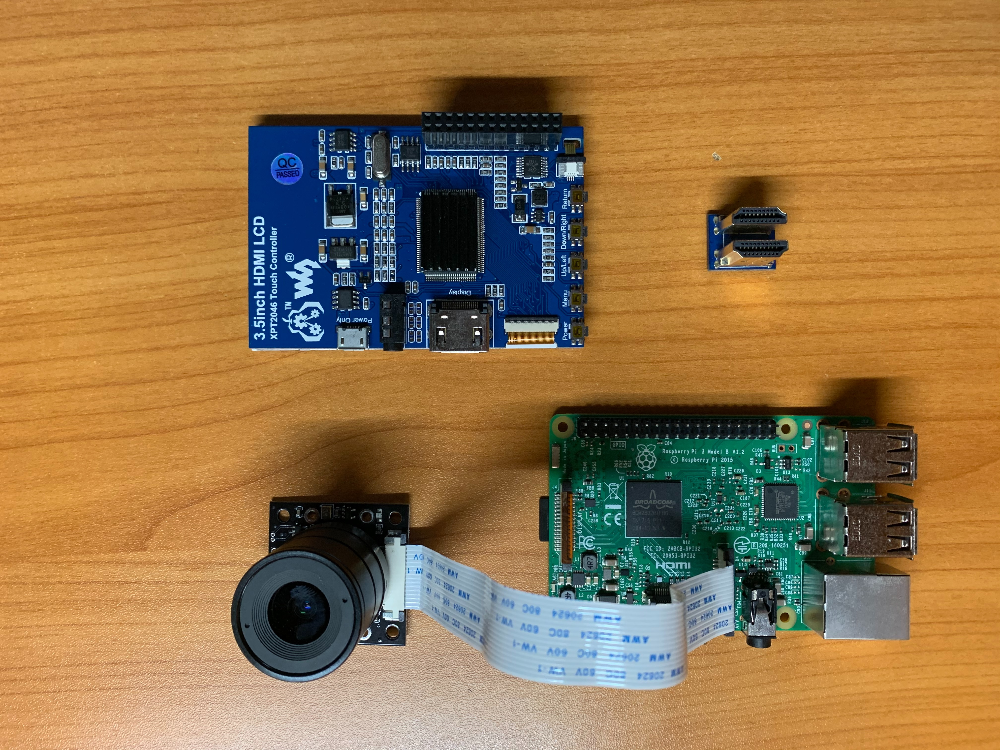
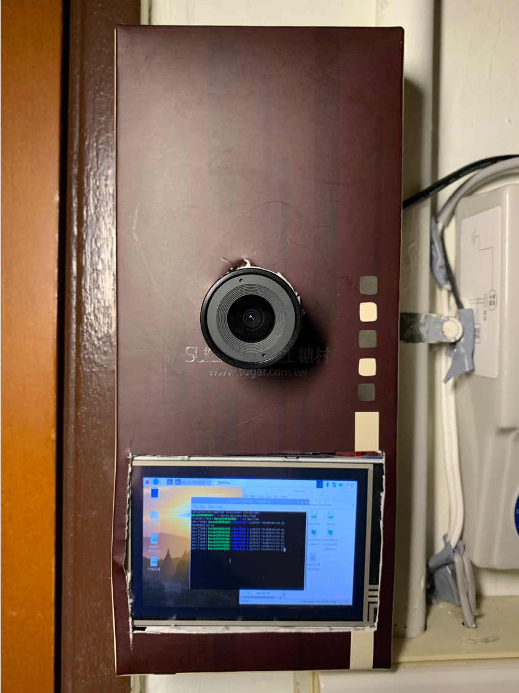
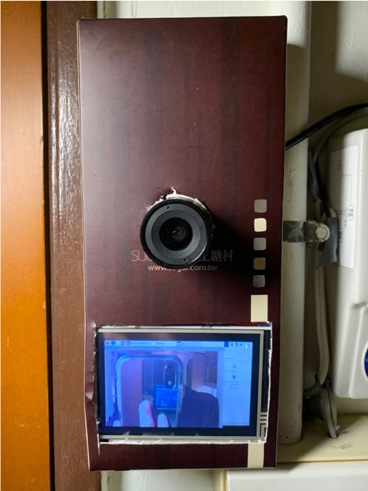
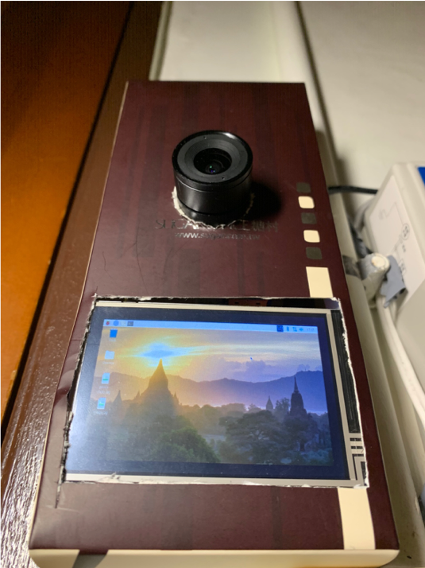
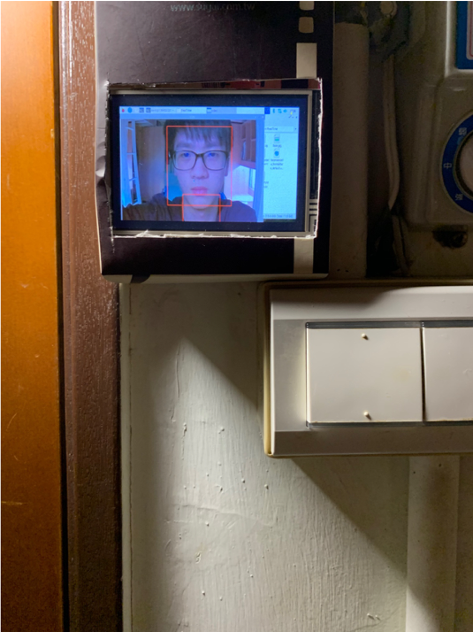

# IoT Final Project : Face Detection on taking attendance

Taking attendance in class by manual is a conventional way to know the students' attendance level. It may be time-consuming to take attendance. Also, teacher may make mistake to write down an inaccurate data. Nowadays, face detection becomes the trend and is applied in many applications. For me, I want to use this technology on taking attendance by ueing python API OpenCV-OpenVINO in Raspberry pi.
## Demo
https://www.youtube.com/watch?v=VupJrFMl-gg

## Required items
* Raspberry pi 3 (Model B)
* Raspberry pi Power supply
* Raspberry Pi 3.5 Inch LCD with HDMI
* Raspberry pi camera NoIR/w CS   
 

## Component Make-Up

 
 
 

## Raspberry Pi Environment Setting

* If you start with a new raspberry pi, you need to set the basic environment before going on.
(Please refer to the attached file: RaspberryPi_setting.pdf)

* Then we set the OpenVINO. All of the steps are clearly written down in the OpenVINO official document. Just follow it step-by-step.

[Install OpenVINO™ toolkit for Raspbian* OS](https://docs.openvinotoolkit.org/latest/_docs_install_guides_installing_openvino_raspbian.html)

[Getting Started with the Intel® Neural Compute Stick 2 on Raspbian](https://www.youtube.com/watch?v=34KN-UJsd58)

*  Now everything are deployed. Let's start coding.

## Programming

In my project, there are two python files and three xml files in *FaceRecognition* folder. Let's analysis how to code works.

### Step 1 : Import the packages

	import cv2
	from lineNotifyMessage import lineNotifyMessage

Import cv2 API and lineNotifyMessage from lineNotifyMessage.py
### Step 2 : Set camera
	faceCascade = cv2.CascadeClassifier('haarcascade_frontalface_default.xml')
	 
	cap = cv2.VideoCapture(0) #get the camera
	 
	cap.set(3,960) # set Width
	 
	cap.set(4,720) # set Height
	 
	count = 0 #count

Use the trained model haarcascade_frontalface_default.xml to detect people face.
### Step 3 : Start to detect faces

Use while loop to detect faces continually.
If you want to know more about cv2 packages and attributes. Please refer to the tutorial below.

[Python影像辨識筆記(三)：Open CV操作筆記](https://medium.com/@yanweiliu/python影像辨識筆記-三-open-cv操作筆記-1eab0b95339c)

[opencv: cv2.flip 图像翻转](https://blog.csdn.net/JNingWei/article/details/78753607)

### Step 4 : Block the detected face
		if count < 5:
            cv2.rectangle(img,(x,y),(x+w,y+h),(0,255,0),2)
            roi_gray = gray[y:y+h, x:x+w]
            roi_color = img[y:y+h, x:x+w]
        
        if count >= 5:
            cv2.rectangle(img,(x,y),(x+w,y+h),(0,0,255),2)
            roi_gray = gray[y:y+h, x:x+w]
            roi_color = img[y:y+h, x:x+w]

We do the if statement. If count<5, show green rectangle. If count<5, show red rectangle to indicate that the face are detected and LINE notify was sent. 
### Step 5 : Send LINE notify
	# send a notify to LINE
	token = 'w5uwWcnzXeopwb0OLoDuwnX4XB2g1v0cQ3xWvCDSsC1'
	picURI1 = 'face.jpg'
	picURI2 = 'body.jpg'

	lineNotifyMessage(token,picURI1,picURI2)
	

we call lineNotifyMessage function via inputing there three parameters: 

* token : a special connected with your LINE account
* picture1 : the picture of your face
* picture2 : the picture of your body 

### Reference documents :

[Real-time Face Recognition: an End-to-end Project](https://www.instructables.com/id/Real-time-Face-Recognition-an-End-to-end-Project/)

[使用 Python 實作發送 LINE Notify 訊息](https://bustlec.github.io/note/2018/07/10/line-notify-using-python/)

[透過 Python 發 Line Notify 三部曲 - 發圖圖圖片](http://pythonorz.blogspot.com/2017/12/python-line-notify_18.html)
